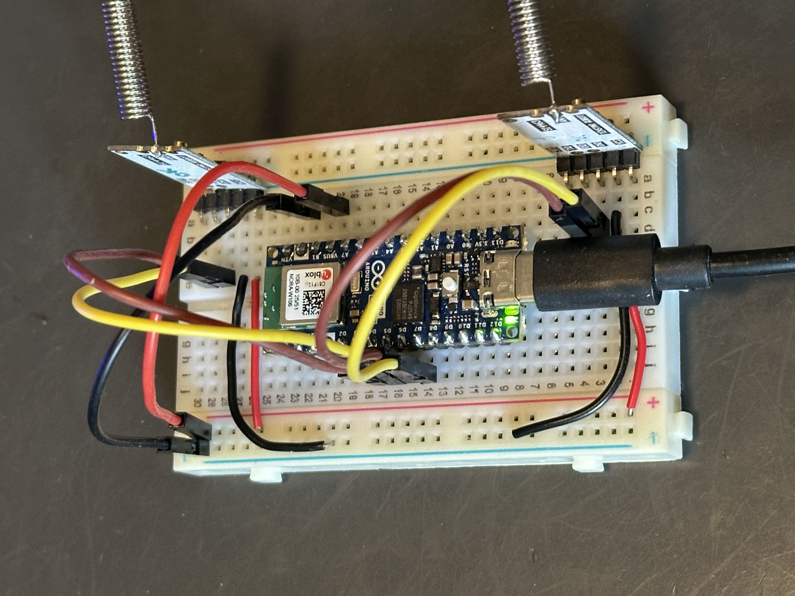
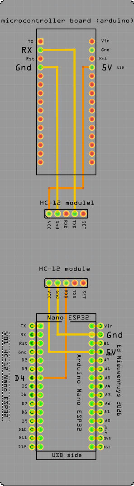
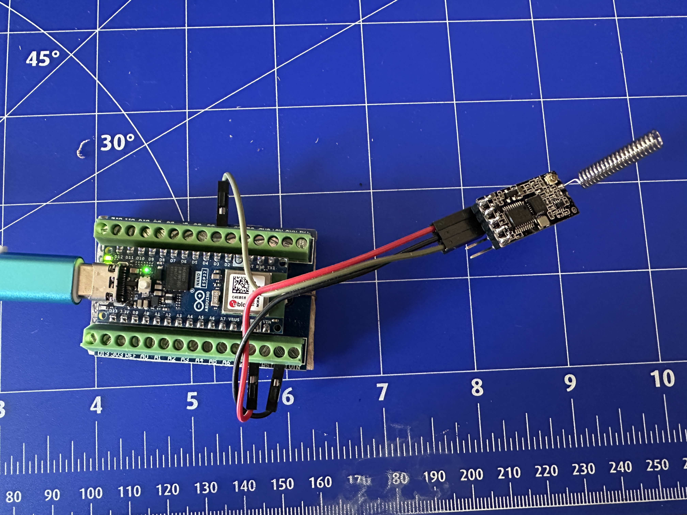
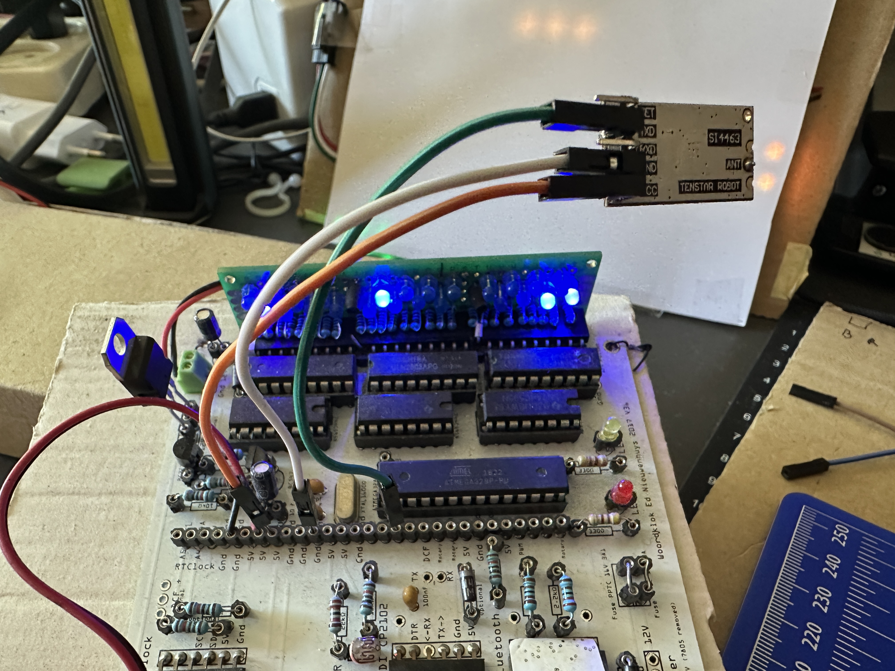

# Arduino Nano ESP32-HC12

[Nederlandse tekst](#nederlandse-tekst)

Arduino ESP32 Nano and HC12 module to send time to another micro controller via the RX port at 9600 baud.

An arduino Nano Every using a DCF77 receiver and HC12 to broadcast time can be found here: [DCF77-HC12](https://github.com/ednieuw/DCF77_HC12).

Time is sent in the format Thhmmss — for example T121500 means quarter past 12.

To verify whether the two HC-12 modules are working, two INO sketches were created for the Nano ESP32.
TestTwoHC12Modules.ino and TestTwoHC12Modules_time.ino. The second one sends the time format for the word clock. 

To update time on my [ATMEGA word clock designs](https://github.com/ednieuw/Woordklok-witte-LEDs) an Arduino Nano ESP32 is used to receive time with WiFi/NTP and send it with a HC-12 S14438 433 MHz long-range wireless serial module to the ATMEGA.

The sketch is derived from [a larger common ESP32 communication project](https://github.com/ednieuw/ESP32Communications).

The ESP32 communication project was stripped from my [Nano ESP32 word clock project](https://github.com/ednieuw/Arduino-ESP32-Nano-Wordclock) that contains (in 2026) the complete manual and instructions.

The Reset settings of this sketch, version V029, are optimised for the HC-12 time sender: HC-12 is set ON by default after a reset.

[Fritzing file here](Nano_ESP32-PCB_HC12.fzz)

---

## Compile and flash instructions

Use the Arduino IDE with the following board settings:

| Setting | Value |
|---|---|
| Board | Arduino Nano ESP32 |
| ESP32 core version | ≥ 3.2.0 |
| Partition Scheme | With FAT |
| Pin Numbering | By Arduino pin (default) |
| USB Mode | Normal (Tiny USB) |

All required libraries are included in the zip file supplied with the sketch (`librariesV029.zip`). Install them via Arduino IDE → Sketch → Include Library → Add .ZIP Library.

---

## Pin assignments (Arduino Nano ESP32)

| Pin | Function |
|---|---|
| D4 | HC-12 TX — sends time to HC-12 module |
| 5V (Vbus) | Power to HC-12 module |
| GND | Ground |

The HC-12 module connects its RX pin to D4 on the Nano ESP32 and communicates at 9600 baud. For more detail see the [HC-12 datasheet](https://www.elecrow.com/download/HC-12.pdf).

---

## First-time setup checklist

1. Flash the sketch with the settings above.
2. Power on — the status LED will blink during startup.
3. Connect your phone/laptop to WiFi SSID `StartESP32Comm` (password `esp32comm`).
4. Open a browser — a captive portal appears to enter your router SSID and password. Or use a BLE terminal app and send `A<ssid>` then `B<password>`.
5. Send `@` to restart. The ESP32 connects to your router and fetches the time via NTP.
6. Confirm the green LED is steady — WiFi is connected.
7. Send `I` (or `II` for full menu) to see the IP address and current status.
8. Verify `HC-12Time=On` in the menu output. If not, send `U` to enable it.
9. Send `K1` to transmit time every minute during initial testing.
10. Once the word clock is receiving time correctly for a day, send `K2` to switch to hourly updates.

---

## Connecting the Nano ESP32 to your WiFi network

### BLE terminal apps

The ESP32 broadcasts a BLE UART service (Nordic UART, service UUID `6E400001-B5A3-F393-E0A9-E50E24DCCA9E`). You can send menu commands to it from any BLE serial terminal app. Confirmed working apps:

- **BLE Serial Pro** (iOS) — supports long strings (>20 bytes per message). Enable with `+` in the menu.
- **Serial Bluetooth Terminal** (Android)
- **LightBlue** (iOS / Android) — useful for testing
- The included [BLE_UART_Terminal.html](BLE_UART_Terminal.html) — open in a Chrome browser (desktop or Android); no app install required

Connect to the device named **ESP32Nano** (or whatever name you set with menu command `C`).

### Logging in to a WiFi network

After first flash, the device starts in Access Point mode with SSID `StartESP32Comm` and password `esp32comm`. Connect your phone or laptop to that network and open a browser to configure credentials — or use the BLE terminal:

1. Send `A` followed by your SSID, e.g. `AMyNetwork`
2. Send `B` followed by your password, e.g. `BMyPassword`
3. Send `@` to restart the ESP32 — it will connect to your router and get the time via NTP.

You can check the current IP address from the menu (`I` or `II`) — look for the `IP-address:` line. Once connected, the web interface is available at that address on port 80.

To scan for available networks, send `G`.

### Turning the HC-12 transmitter on or off

The HC-12 433 MHz module transmits the current time to the ATMEGA word clock every minute. You can toggle it from the menu:

- Send **`U`** — toggles HC-12 time sender On/Off (setting is saved; takes effect immediately)

The current state is shown in the menu info block as `HC-12Time=On` or `HC-12Time=Off`. After a reset (`R`) the HC-12 sender is turned **On** by default.

### Time transmission interval (K0 / K1 / K2)

The `K` command controls how often the time is sent via HC-12 and logged:

- **`K1`** — send time every **minute** (default; useful during initial setup to verify the clock is receiving correctly)
- **`K2`** — send time every **hour** (recommended once the clock is running well; reduces unnecessary transmissions)
- **`K0`** — turn off time logging and transmission; equivalent to disabling the HC-12 sender

Once the word clock is running reliably after a day or so, switching to `K2` is advisable to reduce RF traffic.

---

## Status LED colours

The RGB LED on the PCB indicates the current state of the device:

| Colour | Meaning |
|---|---|
| Red | No WiFi connection |
| Green | WiFi connected |
| Blue | BLE client connected |
| Off | Status LED disabled (toggle with `P`) |

---

## Troubleshooting

**Clock not receiving time**
- Check that HC-12 is enabled: send `II` and look for `HC-12Time=On`. If off, send `U`.
- Make sure `K1` or `K2` is active (not `K0`).
- Verify the HC-12 module is wired correctly: its RX to D4, GND to GND, VCC to 5V (Vbus).

**Cannot connect to WiFi**
- Check SSID length (4–29 chars) and password length (5–39 chars).
- Send `G` to scan and confirm your network is visible.
- Send `R` to reset settings and start over (credentials are kept; only options reset).
- If credentials need to be cleared too, reflash the sketch.

**Web interface not reachable**
- Confirm the green LED is on (WiFi connected).
- Find the IP address via BLE terminal: send `I` and look for `IP-address:`.
- Try navigating to `http://<ip-address>/update` for OTA updates.

---

## Nederlandse tekst

Arduino ESP32 Nano en HC-12 module om de tijd naar een andere microcontroller te sturen.

Een Arduino Nano Every die een DCF77-ontvanger en een HC12 gebruikt om de tijd te versturen is hier te vinden: [DCF77-HC12](https://github.com/ednieuw/DCF77_HC12).

De tijd wordt verzonden in het formaat Thhmmss — bijvoorbeeld T121500 betekent kwart over twaalf.

Om te controleren of de twee HC-12 modules wel werken zijn twee INO-sketches gemaakt voor de Nano ESP32.
TestTwoHC12Modules.ino en TestTwoHC12Modules_time.ino. De tweede verstuurt het tijdformaat voor de woordklok. 

Voor het synchroniseren van mijn [ATMEGA woordklok-ontwerpen](https://github.com/ednieuw/Woordklok-witte-LEDs) wordt een Arduino Nano ESP32 gebruikt om via WiFi/NTP de tijd op te halen en deze via een HC-12 S14438 433 MHz langeafstands draadloze seriële module naar de ATMEGA te sturen.

De sketch is afgeleid van [een groter ESP32-communicatieproject](https://github.com/ednieuw/ESP32Communications).

Dat project is op zijn beurt afgesplitst van mijn [Nano ESP32 woordklok-project](https://github.com/ednieuw/Arduino-ESP32-Nano-Wordclock), waar de volledige handleiding en instructies te vinden zijn (bijgewerkt tot 2026).

De standaardinstellingen van deze sketch, versie V029, zijn geoptimaliseerd voor de HC-12 tijdverzender: na een reset staat de HC-12 standaard **aan**.

[Fritzing-bestand hier](Nano_ESP32-PCB_HC12.fzz)

---

## Compileren en flashen

Gebruik de Arduino IDE met de volgende instellingen:

| Instelling | Waarde |
|---|---|
| Board | Arduino Nano ESP32 |
| ESP32 core-versie | ≥ 3.2.0 |
| Partition Scheme | With FAT |
| Pin-nummering | By Arduino pin (standaard) |
| USB Mode | Normal (Tiny USB) |

Alle vereiste bibliotheken zijn opgenomen in het zip-bestand dat bij de sketch wordt meegeleverd (`librariesV029.zip`). Installeer ze via Arduino IDE → Sketch → Include Library → Add .ZIP Library.

---

## Pinbezetting (Arduino Nano ESP32)

| Pin | Functie |
|---|---|
| D4 | HC-12 TX — stuurt tijd naar HC-12 module |
| 5V (Vbus) | Voeding voor de HC-12 module |
| GND | Massa |

De HC-12 module sluit je RX-pin aan op D4 van de Nano ESP32, communicatie op 9600 baud. Zie het [HC-12 datasheet](https://www.elecrow.com/download/HC-12.pdf) voor verdere details.

---

## Eerste ingebruikname — stappenplan

1. Flash de sketch met bovenstaande instellingen.
2. Zet de stroom aan — de status-LED knippert tijdens het opstarten.
3. Verbind de telefoon/laptop met het WiFi-netwerk `StartESP32Comm` (wachtwoord `esp32comm`).
4. Open een browser — er verschijnt een captive portal om je router-SSID en wachtwoord in te voeren. Of gebruik een BLE-terminal en stuur `A<ssid>` en daarna `B<wachtwoord>`.
5. Stuur `@` om te herstarten. De ESP32 verbindt met je router en haalt de tijd op via NTP.
6. Controleer of de groene LED brandt — WiFi is verbonden.
7. Stuur `I` (of `II` voor het volledige menu) om het IP-adres en de huidige status te zien.
8. Controleer of `HC-12Time=On` in de menuuitvoer staat. Zo niet, stuur `U` om het in te schakelen.
9. Stuur `K1` om de tijd elke minuut te verzenden tijdens de eerste test.
10. Zodra de woordklok een dag lang correct de tijd ontvangt, stuur `K2` voor verzending per uur.

---

## De Nano ESP32 verbinden met het WiFi-netwerk

### BLE-terminal apps

De ESP32 zendt een BLE UART-service uit (Nordic UART, service UUID `6E400001-B5A3-F393-E0A9-E50E24DCCA9E`). Je kunt menutoetsen sturen via elke BLE seriële terminal-app. Bevestigd werkende apps:

- **BLE Serial Pro** (iOS) — ondersteunt lange strings (>20 bytes per bericht). Activeer met `+` in het menu.
- **Serial Bluetooth Terminal** (Android)
- **LightBlue** (iOS / Android) — handig voor testen
- De meegeleverde [BLE_UART_Terminal.html](BLE_UART_Terminal.html) — open in Chrome (desktop of Android); geen app-installatie nodig

Verbind met het apparaat genaamd **ESP32Nano** (of de naam die is ingesteld met menuopdracht `C`).

### Inloggen op een WiFi-netwerk

Na de eerste flash start het apparaat in Access Point-modus met SSID `StartESP32Comm` en wachtwoord `esp32comm`. Verbind je telefoon of laptop met dat netwerk en open een browser om de inloggegevens in te stellen — of gebruik de BLE-terminal:

1. Stuur `A` gevolgd door de SSID, bijv. `AMijnNetwerk`
2. Stuur `B` gevolgd door het wachtwoord, bijv. `BMijnWachtwoord`
3. Stuur `@` om de ESP32 te herstarten — hij verbindt dan met de router en haalt de tijd op via NTP.

Het IP-adres is te zien via het menu (`I` of `II`) — zoek naar de regel `IP-address:`. Eenmaal verbonden is de webinterface beschikbaar op dat adres via poort 80.

Stuur `G` om beschikbare netwerken in de buurt te scannen.

### De HC-12-zender aan- en uitzetten

De HC-12 433 MHz-module stuurt elke minuut de huidige tijd naar de ATMEGA woordklok. Je kunt dit in- of uitschakelen via het menu:

- Stuur **`U`** — schakelt de HC-12-tijdverzender aan of uit (instelling wordt opgeslagen; werkt direct)

De huidige status staat in het menu-informatieblok als `HC-12Time=On` of `HC-12Time=Off`. Na een reset (`R`) staat de HC-12-zender standaard **aan**.

### Tijdverzendinterval (K0 / K1 / K2)

Met het `K`-commando stel je in hoe vaak de tijd via HC-12 wordt verzonden en gelogd:

- **`K1`** — stuur de tijd elke **minuut** (standaard; handig tijdens de eerste installatie om te controleren of de klok de tijd correct ontvangt)
- **`K2`** — stuur de tijd elk **uur** (aanbevolen zodra de klok goed loopt; vermindert onnodig RF-verkeer)
- **`K0`** — zet tijdlogging en -verzending uit; vergelijkbaar met het uitschakelen van de HC-12-zender

Zodra de woordklok na een dag of zo stabiel loopt, is overschakelen naar `K2` aan te raden.

---

## Betekenis status-LED kleuren

De RGB-LED op de PCB geeft de huidige toestand van het apparaat aan:

| Kleur | Betekenis |
|---|---|
| Rood | Geen WiFi-verbinding |
| Groen | WiFi verbonden |
| Blauw | BLE-client verbonden |
| Uit | Status-LED uitgeschakeld (schakel om met `P`) |

De twee extra PCB-LEDs (D9, D10) knipperen afwisselend elke seconde als hartslag.

---

## Probleemoplossing

**Klok ontvangt geen tijd**
- Controleer of HC-12 ingeschakeld is: stuur `II` en kijk of `HC-12Time=On` verschijnt. Zo niet, stuur `U`.
- Controleer of `K1` of `K2` actief is (niet `K0`).
- Controleer de bedrading: RX van HC-12 naar D4, GND naar GND, VCC naar 5V (Vbus).

**Kan niet verbinden met WiFi**
- Controleer de SSID-lengte (4–29 tekens) en wachtwoordlengte (5–39 tekens).
- Stuur `G` om te scannen en te bevestigen dat je netwerk zichtbaar is.
- Stuur `R` om instellingen te resetten en opnieuw te beginnen (inloggegevens blijven bewaard).
- Als ook de inloggegevens gewist moeten worden, flash de sketch opnieuw.

**Webinterface niet bereikbaar**
- Controleer of de groene LED brandt (WiFi verbonden).
- Zoek het IP-adres via de BLE-terminal: stuur `I` en kijk bij `IP-address:`.
- Probeer `http://<ip-adres>/update` voor OTA-updates.
